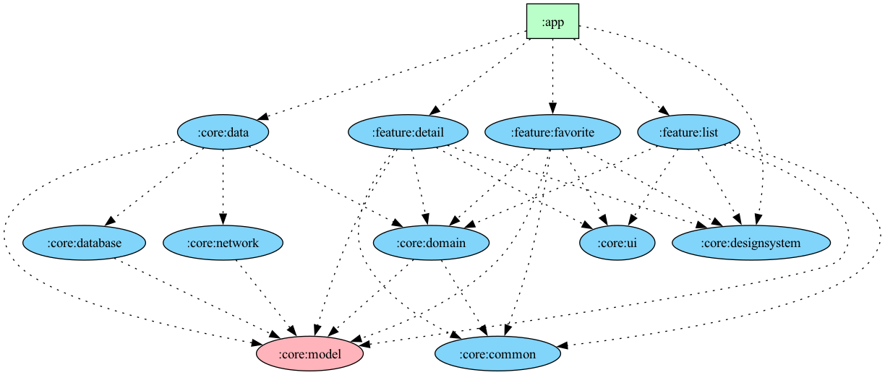

# Breaking Bad - Jetpack Compose
<a href='https://developer.android.com'></a>
<a href="https://kotlinlang.org/docs/whatsnew1720.html"></a>
<a href="https://developer.android.com/jetpack/androidx/releases/compose#versions"></a>
<a href="https://opensource.org/licenses/Apache-2.0"></a>
[](https://ktlint.github.io/)

<p >


</p>

## Tech Stack
- [Jetpack](https://developer.android.com/jetpack)
    - Compose - Define your UI programmatically with composable functions that describe its shape
      and data dependencies.
    - Hilt - Extend the functionality of Dagger Hilt to enable dependency injection.
    - Lifecycle - Build lifecycle-aware components that can adjust behavior based on the current
      lifecycle state
    - Room - Create, store, and manage persistent data backed by a SQLite database.
    - ViewModel - Store and manage UI-related data in a lifecycle conscious.
    - App Startup - initialize components at app startup.
- Clean Architecture (nowinandroid)
- MVVM pattern
- Kotlin Coroutines & Flows
- Material Design
- Single Activity
- StaggeredVerticalGrid
- [Gradle Version Catalog](https://docs.gradle.org/7.4/userguide/platforms.html)
- [Accompanist](https://google.github.io/accompanist)
- [Retrofit2](https://github.com/square/retrofit)
- [Coil-Compose](https://coil-kt.github.io/coil/compose)
- [Timber](https://github.com/JakeWharton/timber)

## Multi Module ([nowinandroid](https://github.com/android/nowinandroid))


### If you think this reposittory is useful, please press the star button at the top. ⭐️

# License

```xml
    Designed and developed by 2021 shinhyo

    Licensed under the Apache License, Version 2.0 (the "License");
    you may not use this file except in compliance with the License.
    You may obtain a copy of the License at

    http://www.apache.org/licenses/LICENSE-2.0

    Unless required by applicable law or agreed to in writing, software
    distributed under the License is distributed on an "AS IS" BASIS,
    WITHOUT WARRANTIES OR CONDITIONS OF ANY KIND, either express or implied.
    See the License for the specific language governing permissions and
    limitations under the License.
```
