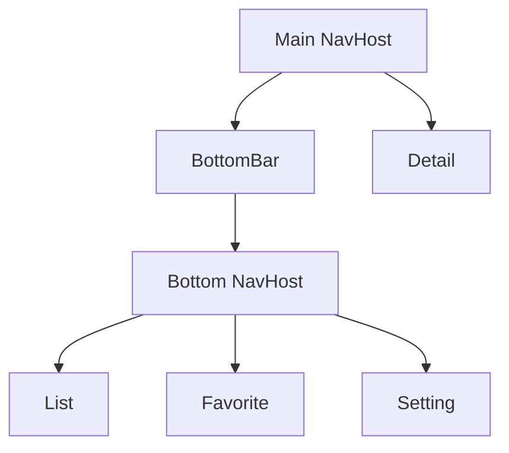
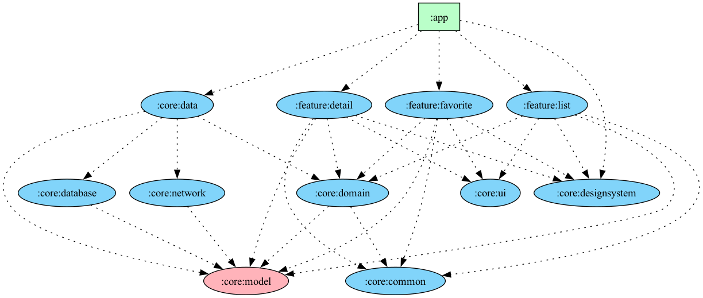

<h1 align="center"> 🧪 Breaking Bad - Jetpack Compose</h1>

<p align="center">
  <a href='https://developer.android.com'></a>
  <a href="https://kotlinlang.org/docs/home.html"></a>
  <a href="https://developer.android.com/jetpack/compose/bom"></a>
  <a href="https://opensource.org/licenses/Apache-2.0"></a>
</p>

<p align="center">
  
  
  
</p>

## Tech Stack

- [Jetpack](https://developer.android.com/jetpack)
  - Compose - Define your UI programmatically with composable functions that describe its shape
    and data dependencies.
  - Hilt - Extend the functionality of Dagger Hilt to enable dependency injection.
  - Lifecycle - Build lifecycle-aware components that can adjust behavior based on the current
    lifecycle state
  - Room - Create, store, and manage persistent data backed by a SQLite database.
  - ViewModel - Store and manage UI-related data in a lifecycle conscious.
  - App Startup - initialize components at app startup.
- Clean Architecture (multi module)
- MVVM pattern
- Kotlin
  - Coroutines
  - Flows
  - Serialization
- [Type Safety Navigation](https://developer.android.com/guide/navigation/design/type-safety)
- Material Design 3
  - [Material Theme Builder](https://material-foundation.github.io/material-theme-builder/)
- Single Activity
- StaggeredVerticalGrid
- [Gradle Version Catalog](https://docs.gradle.org/current/userguide/platforms.html)
- [Retrofit2](https://github.com/square/retrofit)
- [Coil-Compose](https://coil-kt.github.io/coil/compose)
- [Timber](https://github.com/JakeWharton/timber)
- [Haze](https://github.com/chrisbanes/haze)
- [SharedElement](https://developer.android.com/guide/fragments/animate#shared)
- [Kover](https://github.com/Kotlin/kotlinx-kover)

## Multi Module

```
├── app
├── core
│   ├── common
│   ├── data
│   ├── database
│   ├── datastore
│   ├── designsystem
│   ├── domain
│   ├── model
│   └── network
└── feature
    ├── bottombar
    ├── detail
    ├── favorite
    ├── list
    ├── main
    └── setting
```

The file structure is similar to Now in Android, but to follow Clean Architecture, the domain layer
does not reference the data layer.

## Nested NavHosts


```mermaid
graph TD
    A[Main NavHost] --> B[BottomBar]
    A --> C[Detail]
    B --> D[Bottom NavHost]
    D --> E[List]
    D --> F[Favorite]
    D --> G[Setting]
```

Even though using nested NavHosts makes things more complex, this approach was chosen to achieve screen transition animations similar to those between Activities.

(One NavHost needs to manage how to hide the bottom navigation and apply animations during screen transitions.)

# Module Graphs



